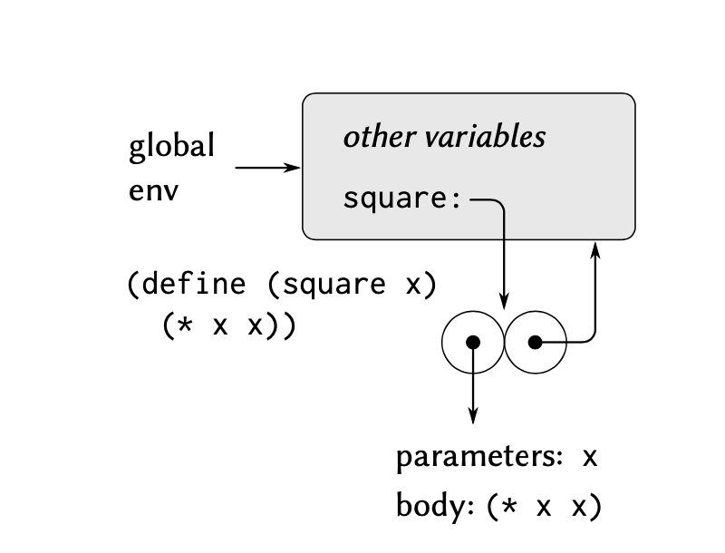
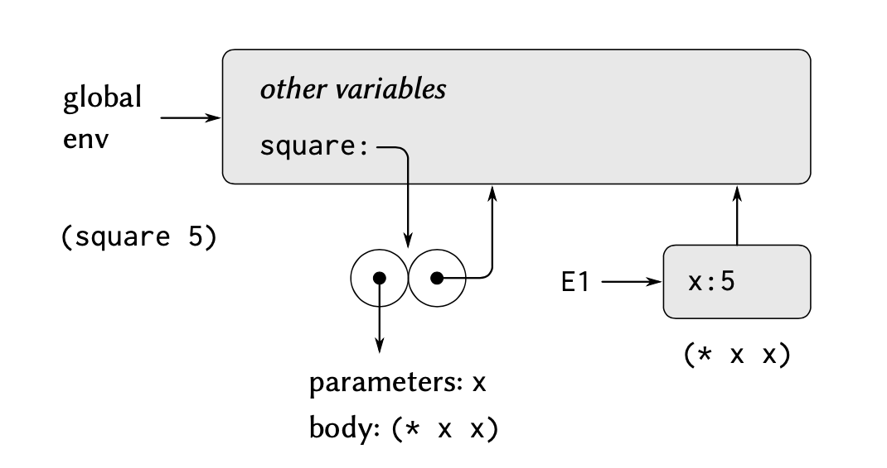

# 3.2 The Environment Model of Evaluation

在存在赋值的程序设计语言中, 简单的代换模型将不再适用, 取而代之的是环境模型

在这种模型下, 变量不再能够被看作一个 值的名字. 而是被指派为 "值" 所存储的位置, 这个位置信息就会被存放在 "环境" 这个数据结构中
环境可以被看作 frame 的序列, 每个 frame 都是一个存放 bindings 的 table, bindings 用来关联变量名和它对应的值。在一个 frame **中的一个 variables 至多可以关联一个 bindings。**(不是一个 frame 只能有一个 binding)
**每一个 frame** 还会包含一个指向外围环境 (enclosing environment) 的指针, 除非该 frame 出于讨论的目的被认为是全局 frame (这种情况下指向的外围环境就不存在)

我们在描述 **某个环境下 "变量的值"** 的时候, 实际上就来自于 **这个环境下第一个包含该变量的 binding 的 frame** (这里的第一自然如同链表一般由内而外, 先看最内层再看外层)
如果这个变量没有任何 frame 存在对应的 bindings, 那么这个变量就称为在这个环境下 unbound (未绑定的)

由于我们由内向外的去检查 frame 和 bindings 那么很有可能会出现内部变量遮蔽外部的情况

```
              +------------+
              |         I  |
              |            |
              | x:3        |
              | y:5        |
              +------------+
                   ^  ^
                 C |  | D
    +------------+ |  | +------------+
    |         II | |  | |        III |
    |            +-+  +-+            |
    | z:6        |      | m:1        |
    | x:7        |      | y:2        |
    +------------+      +------------+
          ^                    ^
          |                    |
          +                    +
          A                    B

```

比如上面的环境示意中环境 II 中的 x 和环境 III 中的 y 就遮蔽了外部环境
进一步的，我们甚至可以断言，一个程序语言中的表达是本身**没有意义**，其意义完全来自于其所处的环境
比如对于表达式 `(+ 1 1)`, 如果没有外界环境赋予其 加法 的意义, 那么这个表达式就没有意义

## 3.2.1 求值规则

### 创建过程

在 environmen model of evaluation 中，一个过程总是由一些代码和一个指向 **求值(evaluate) 该 λ 表达式的环境** 的指针构成的 pair。对于过程的定义本质上是**求值一个 lambda 表达式**并将其 bind 到一个 variable

```scheme
(define (square x)
   (* x x))

(define square-acually
   (lambda (x) (* x x)))
```

其对应的求值可以用下图表示



可以看出我们创建的过程的 binding 出现在了全局环境中。并且指向存放这个过程相关数据的数据结构

这样一个数据结构是一个 pair, 一部分指向函数相关信息，包括形式参数，函数体。另一部分指向全局环境，因为这个 λ 表达式是在全局环境中被求值的。

所以通常而言，`define` 所做的事情，便是将这个 binding 加入全局的 frame 中。

### 应用过程

如果要对一组合表达式求值:
1) 求值这一组合式里的各个子表达式， 
2) 将运算符子表达式的值应用于运算对象子表达式的值。

应用过程时，环境模型定义了如下操作：

1. 将过程应用于实际参数时，会创建一个新环境，此环境包括将形式参数名绑定到实际参数值的 frame。而这个 frame 指向的环境便是应用参数到过程的环境。
2. 接下来在这个新环境下执行对 函数体表达式 的求值。

还是以我们定义的 `square` 为例。其表现如下：



我们创建了一个新环境，指向应用此过程的环境即全局环境。并创建一个包含 binding 形参 x 到实参值 5 的  frame。

接下来我们就在环境 E1 里执行求值过程体表达式 `(* x x)` 并获得结果 25。

### 总结

从上面的过程创建和应用中可以总结出：

1. **在环境中求值 lambda 表达式,** 将创建一个过程对象，该对象为一个 pair,  用于存储 lambda 表达式的 body, params 信息和**指向求值环境的指针**。任何 define 过程本质上都是在求值 lambda 表达式并将其绑定到变量名。
2. 将此 pair 过程对象应用到一系列实际参数，会构造出一个属于新环境的新 frame。将形式参数绑定到实际参数的值。然后在新环境中求值过程对象中存储的 body。**这个环境的外围环境就是这个被应用的环境对象所指向的那个环境**

### 补充

正如前文所言， define 就是建立一个 binding，将值绑定到名字上去。

而对于 `(set! <variable> <value>)` 这个迫使我们引入环境模型的罪魁祸首。对其的求值过程：

1. 找到包含这个 variable 的 binding 的第一个 frame (最内层)
2. 修改 binding。如果找不到就会报错

## 3.2.2 实例：应用（Apply）简单的复合过程

以在全局环境下求值如下代码为例

```scheme
(define (square x)
  (* x x))

(define (sum-of-squares x y)
  (+ (square x) (square y)))

(define (f a)
  (sum-of-squares (+ a 1) (* a 2)))

(f 5)
```

其计算方式如下：


1. 过程创建:  `square`, `sum-of-squares`  和 `f` 的 bindings 都被放入全局环境的 frame 中

2. 求值 `(f 5)`:  就是将 5 应用到 f 对应的过程对象 上

   1. 创建一个新环境
   2. 创建 a -> 5 的 binding
   3. 求值 f 对应的 body 表达式

3. 求值` (sum-of-squares (+ a 1) (* a 2))`, 这又是一个复合过程,

   1. 我们优先求解子表达式 `(+ a 1)` 和 `(* a 2)` 得到结果 6, 10。
   2. 将 6.10 应用到 sum-of-squares,  开始重复 2 的流程： 
      1. 创建一个新环境
      2.  创建 x, y -> 6,10 的 binding
      3. 求 sum-of-squares 的 body 表达式

4. 求值 `(+ (square 6) (square 10))`:  还是需要先求值子表达式, 即 (square 6) 和 (square 10)

   1. 为 (square 6) 和 (square 10) 分别创建环境, 并应用过程,  绑定实参,   求值 body, 得到结果 36, 100

5. 回到 4. 36 + 100 = 136, 计算结束

   

## 3.2.3 作为局部状态存储库的 Frames

考虑如下代码：

```scheme
(define (make-withdraw balance) 
  (lambda (amount)
		(if (>= balance amount)
				(begin (set! balance (- balance amount)) 
               balance)
        "Insufficient funds")))

(define W1 (make-withdraw 100))
(W1 50)
```

第一个 define 很简单，本身是实现如下变化：创建一个过程对象，存储 body，形式参数，并指向创建该过程对象的环境。


```scheme
(define make-withdraw
  (lambda (balance)
    (lambda (amount)
			(if (>= balance amount)
					(begin (set! balance (- balance amount)) 
               	balance)
        	"Insufficient funds"))))
```

而第二个 define 中，则是要先求值子表达式 `(make-withdraw 100)` 。 进而应用过程，创建一个新环境 E1, 将 100 绑定到 balance 形参。并进一步求内部表达式。

内部表达式又是一个 lambda 表达式。再次生成一个过程对象如下：


此时的过程对象的外界环境指向的就是 E1。最后将这个过程对象绑定到 global Env 的 W1.

最后，开始调用 `(W1 50)` 。 应用过程对象

1. 创建新环境，外界环境指针指向 W1 的过程对象 pair 所指向的环境 E1.
2. 将 50 绑定到 W1 对应的过程对象的形式参数 amount 上。
3. 开始求值内部表达式， 通过环境链表我们可以依次找到 amount 和 balance，并应用到环境表达式中计算。
4. 调用 `set!` 时，balance 的 binding 会被修改，修改后的 balance 的 binding 会是 50.


而我们如果重新定义一个 `(define W2 (make-withdraw 100))` 会产生一个全新的环境，而环境中的 bindings 就不会相互冲突。因此能够实现对象局部状态的修改不会影响到下一个对象。

## 3.2.4 内部定义的解释

对于如下函数 sqrt 中，存在内部定义，当 sqrt 被调用时，可以画出下面的环境图。内部定义的各个 bindings 都存放在 sqrt 过程应用时所创建的新环境 E1 中。

```scheme
(define (sqrt x)
  (define (good-enough? guess)
  	(< (abs (- (square guess) x)) 0.001)) 
  (define (improve guess)
  	(average guess (/ x guess))) 
  (define (sqrt-iter guess)
		(if (good-enough? guess) 
        guess
        (sqrt-iter (improve guess))))
  (sqrt-iter 1.0))

```


