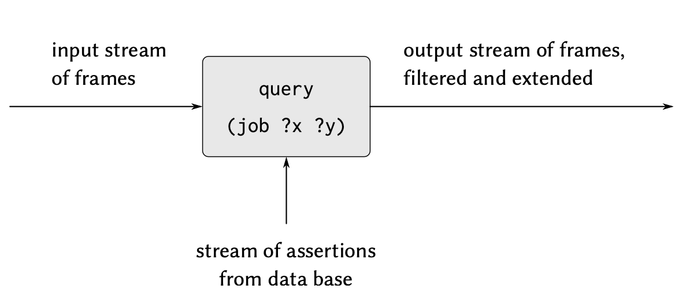

# Ways to achieve logic query system

1. Implement it as a nondeterminstic program, using the amb evaluator.
2. Manage with the search with the aid of streams.

## Central Operations: Pattern Matching and Unification

### Pattern Matching
A *pattern matcher* is a program that tests whether some datum fits a specified pattern. 

> `((a b) c (a b))` matches the pattern `(?x c ?x)`
> It also matches `(?x ?y ?x)` and `((?x ?y) c (?x ?y))`

The pattern matcher used by the query system takes as inputs a pattern, a datum, and a *frame* that specifies bindings for various pattern variables. 

> 也就是说这个 matcher 本身包含了一个 pattern，一个传入 pattern 的数据，和这些 pattern 中可能已经被部分赋值的那些变量的绑定（来自于之前的 pattern match)。 如果这个阶段的 datum 也可以匹配到 pattern, 就用 datum 中的各个部分匹配那个 frame 对应的 binding 进行填充。最后返回一个 frame。如果匹配失败，则直接标记失败。

For example,

1. using the pattern `(?x ?y ?x)` to match `(a b a)` given an empty *frame* will return a frame specifying that `?x` is bound to `a` and `?y` is bound to `b`.

2. Trying the match with the same pattern, the same datum, and a frame specifying that `?y` is bound to `a`  will fail.
3. Trying the match with the same pattern, the same datum, and a frame in which `?y` is bound to `b` and `?x` is unbound will return the gvien frame augumented by a binding of `?x` to `a`.


The pattern matcher is all the mechanism that is needed to process simple queries that don't involve rules.

`(job ?x (computer program))`

We scan through all assertions  in the *database* and select those that match the pattern with respect to an initially empty frame.

For each match the find, we use the frame returned by the match to instantiate the pattern with a value for `?x`.

### Streams of frames

We use stream to manage our output frame.

Let's say we have started to conduct a search procedure: 

We provide a empty frame.

We search all the entry of database, the result is either a special symbol indicating that the match has failed or an extension to the frame.

The result is a stream of all the frames that extend the given frame via a match to some assertion in the database.



In our system, a query takes an input stream of frames and performs the above matching operation for every frame in the stream. And for each checking of the assertion we will generate a new stream. Which indicate the extension of existing frame by apply all sensible variables on unassigned varibles.

**To answer a simple query**, we use the query with an input stream consisiting of single empty frame. The resulting output **stream** of copies of the original query pattern with the variables instantiated by the values in each frame, and this is the stream that is finaly printed.


### Compound Queries

The processing of compound queries makes use of the ability of our matcher to demand that a match be consistent with a specified frame. 

复合查询的处理利用了我们的匹配器（matcher）要求 (demand) 匹配结果 (a match) 与指定的框架（a specified frame) 保持一致 (be consistent with) 的能力。

For example, to handle the **and** of two queries, such as

```scheme
(and (can-do-job ?x (computer programmer trainee)) 
     (job ?person ?x))
```

we first find all entries that match the pattern

```scheme
(can-do-job ?x (computer programmer trainee))
```

Thiis produces a stream of frames, each of which contains a binding for

?x. Then for each frame in the stream we find all entries that match

```scheme
(job ?person ?x)
```

in a way that is consistent with the given binding for `?x`. 

Each such match will produce a frame containing bindings for `?x` and `?person`.

#### And

The **and** of two queries can be viewed as a series combination of the two component queries.

>  下图展现了我们的 And 是如何作用于一个 compound query 的，我们将其拆分为两个 component query (有可能是 simple query, 也有可能是 compound query，甚至可能是 rule )按序执行
>
> 每一个 component query 都接受一个 stream of frames 和 data base 的数据，产出一个新的 stream frame，frame 中的每个元素都是对于这个查询执行后的一个变量的 binding . 而在下图中 B 接受的 stream of frames 则来自于 A，经过 B 和 database 后，产出一个新的 stream of frames，frame 中的 bindings 则同时包含了 `?x` 和 `?person`.


#### Or

For **or** operation，it works as a parallel combination of two component queries. The input stream of frames is extended separately by each query. The two resulting streams are then merged to produce the final output stream.


It's obvious that the execution of complex queries can be time-costing because it's like a tree shape, which in worst case can lead to exponential in the number of queries.

#### Not

From the stream-of-frames viewpoint, the **not** of some query acts as a filter that removes all frames for which the query can be satisfied. For instance, given the pattern

```scheme
(not (job ?x (computer programmer)))
```

we attempt, for each frame in the input stream, to produce extension frames that satisfy `(job ?x (computer programmer))`. We **remove** from the **input stream** all frames for which **such extensions exist.** 

For example, in processing the query

```scheme
(and (supervisor ?x ?y)
		 (not (job ?x (computer programmer))))
```

the first clause will generate frames with bindings for ?x and ?y. the **not** clause will then filter these by removing all frames in which the binding for ?x satisfies the restriction that ?x is a computer programmer.

> 对于 not 来说
>
> 1. 首先通过上游获取了 input stream of frames , 每个 frame 都是包括 ?x 和 ?y 的 bindings
>
> 2. 然后通过 (job ?x ...) 找到那些 ?x 是 computer programmer 的 stream of frames. 每个 frame 里面的 binding 就是 ?x
>
> 3. 然后将 1 中的 stream 进行 filter (参见 add, 本质上就是按序执行)，2 中返回的 stream 中的元素会被排除(求差集)。

#### lisp-value

The lisp-value special form is implemented as a similar filter on frame streams. 

We use each frame in the stream to instantiate any variables in the pattern, then apply the Lisp predicate. We remove from the input stream all frames for which the predicate fails.

### Unification

In order to handle **rules** in the query language, we must be able to find the rules whose **conclusions match a given query pattern.** 

Rule **conclusions** are like **assertions** except that they can contain variables, 

```
(rule ⟨conclusion⟩ ⟨body⟩) 
where ⟨conclusion⟩ is a pattern and ⟨body⟩ is any query

(rule (lives-near ?person-1 ?person-2)
      (and (address ?person-1 (?town . ?rest-1))
           (address ?person-2 (?town . ?rest-2))
           (not (same ?person-1 ?person-2))))
```

so we will need a generalization of pattern matching—called **unification**—in which both the “pattern” and the “datum” may contain variables.

> 为了在查询语言中处理**规则**，我们必须能够找到**结论与给定查询模式相匹配的规则。**
>
> **规则的结论**类似于**断言**，但是它们可以包含变量，因此我们需要模式匹配的一种泛化——称为**合一**——其中"模式"和"数据"都可以包含变量。
>
> 详细来说
>
> 1. 我们在使用 Rule 的时候，第一步是要找到我们定义 Rule 的地方，并且判断我们定义的 Rule 和使用 Rule 应该是一个（类比于通过函数名寻找函数签名, 假设函数签名匹配不上说明当前这个函数签名并不是我们需要的)。
> 2. 相较于函数签名的名字和入参，规则使用 Conclusion 这一名词来类比。
> 3. Conclusion 长得像一个断言 assertion，但是它可以包含变量。
> 4. 我们在通过某个语句去查询可能的 data 或者 rule 时，需要有一个通用的方法，既可以处理这个语句本身对应就是一个对 database 的查询，又可以处理这个语句是对应一个 Rule 的结论的匹配。
>    1. 对于前者，正如前面所说，我们会利用一般的模式匹配找到 database 中符合模式的数据完成。
>    2. 而对于后者，我们则不能直接去把它用一般的模式匹配进行数据的检索了，而是要保留这个变量，去系统中找到我们可能定义的符合这种变量的 Rule 的 conclusion.
>
> 5. 因此，我们就引入了 Unification，即合一，合一是模式匹配的泛化（更宽泛的模式匹配），因为除了模式，它匹配的数据都是可以包含**变量**。这有别于一般的模式匹配。

A unifier **takes two patterns**, each containing constants and variables, and determines whether it is possible to assign values to the variables that will make the two patterns equal. If so, it returns a frame containing these bindings.

For example, unifying `(?x a ?y)` and `(?y ?z a)` will specify a frame in which `?x` , `?y` and `?z` must all be bound to `a`.

On the other hand, unifying `(?x ?y a)` and `(?x b ?y)` will fail cuz there's no value for `y` that can make the two patterns equal.

> 作为一种更加泛化的模式匹配，Unification 不是利用 datum 去匹配 pattern，而是检测两个 pattern (因为其中带有变量，所以本身就是 pattern 而非纯数据了)是否可以通过某种方式“合一”。也就是如果这个 pattern 中的 bindings 可不可以在全部或部分赋值后表示同样一个 pattern. 
>
> 实现 合一 的算法是查询系统中最困难的部分，在面对复杂 pattern 的时候，就像是在解一个联立方程组。不过，和解方程组不同之处在于我们并不需要去求解所有的 未知数 => 将所有的 variable 进行绑定，而是可以在部分 variable 依然处于未绑定的情况下完成匹配。

### Applying rules

Consider processing a query that involves applying a rule, such as 

```scheme
(lives-near ?x (Hacker Alyssa P))
```

To process this query,

1. We use the ordinary pattern-match procedure 
