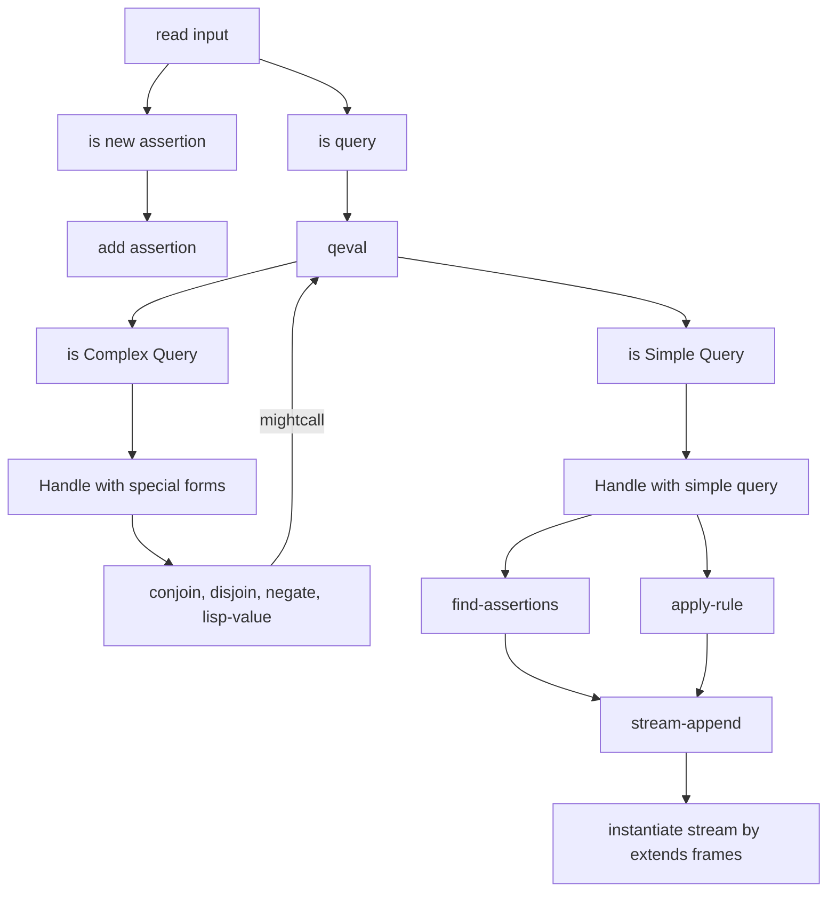

# Implementing the Query System


### The Driver loop and Instantiation 驱动循环与实例化

Driver Loop 和一般的 REPL 的 driver loop 类似，不停读取传入的的表达式。

如果传入的表达式为插入一个规则 (Rule) 或者断言 (Assertion). 那么就将它加入数据库。

否则，就将表达式理解为查询 (Query).  

1. Driver 会将查询传给我们的解释器 `qeval`， 同时也会初始化一个包括单个空 frame 的 stream 一并传入。
2. 解释器的输出同样是一个 stream，其中的 frame 是通过让用数据库中找到的变量值满足 (Satisfying) 查询 (Query) 生成的。
3. 这些 frames 会被用来形成一个新的 stream，这个 stream 会包括那个原始查询的副本，同时这些副本中的变量会被 frames 中的 bindings 进行实例化。
4. 最终我们将这个 stream 输出，也就是我们要的结果。


```scheme
(define (query-driver-loop)
  (prompt-for-input input-prompt)
  ;; 和一般的 driver loop 不同，我们需要先解析读取数据的语法, 判断是直接插入 assert 还是执行查询
  ;; read primitive 会自动处理传入 dotted tails 参数的情况,
  ;; 1. 对于 pattern: (computer ?type) => (cons 'computer (cons 'type ()))
  ;; 2. 对于 pattern: (computer . ?type) => (cons 'computer 'type) 直接将后面的整个东西作为 cdr 的部分解释，而不是将其作为 cons 的 car 部分
  ;; 因此我们天然就支持了 dotted tail 表达式
  (let ([q (query-syntax-process (read))])
    (cond
      [(assertion-to-be-added? q)
       (add-rule-or-assertion! (add-assertion-body q))
       (newline)
       (display "Assertion added to database.")
       (query-driver-loop)]
      [else
       (newline)
       (display output-prompt)
       (display-stream
        ;; qeval 结果还是一个 stream，将每一个 frame 都实例化
        (stream-map (lambda (frame)
                      (instantiate q frame
                        [lambda
                            (v f)
                          ;; 将在读入阶段被拆分成 ('? var) 的 ?var 重新以字符串形式显示
                          (contract-question-mark v)]))
                    ;; 执行 qeval 解析查询和一个空 frame stream
                    (qeval q (singleton-stream '()))))
       (query-driver-loop)])))
```


To instantiate an expression, we copy it, replacing any variables in the expression by their values in a given frame. The values are them- selves instantiated, since they could contain variables (for example, if ?x in exp is bound to ?y as the result of unification and ?y is in turn bound to 5). The action to take if a variable cannot be instantiated is given by a procedural argument to instantiate.

为了实例化一个表达式，我们复制它，用给定 frame 中对应变量的值进行替换。这些变量本身可能也需要被实例化。因为他们可能包含变量（例如如果 Unification 使得 `?x` 被绑定到 `?y,` 而 `?y` 又进一步被绑定到 5.)。在一个变量无法被实例化的情况下采取的动作由 instantiate 函数的另一个过程参数给出。

在 driver-loop 中, 没有被实例化的变量会被从 `(cons '? <VAR>)` 重新拼接成 `?<VAR>` 字符串

而在 lisp-value 中, 则会直接报错, 因为这将无法进行 lisp-value 的运算.

```scheme
(define (instantiate exp frame unbound-var-handler)
  (define (copy exp)
    (cond
      ;; 如果是一个变量，我们就尝试从 frame 中寻找对应的 binding
      [(var? exp)
       (let ([binding (binding-in-frame exp frame)])
         ;; 如果找到，就继续尝试 copy 其结果 (因为 binding 有可能结果也是变量作为引用)
         (if binding
             (copy (binding-value binding))
             (unbound-var-handler exp frame)))]
      ;; 如果是 list，则递归一个一个处理并连接
      ;; 理论上, exp frame 应该是一个 binding list
      ;; 我们一个一个提出 bidnding 进行数据实例化
      [(pair? exp) (cons (copy (car exp)) (copy (cdr exp)))]
      ;; 其他情况下，直接返回原始值
      [else exp]))
  (copy exp))
```


### 实现求值器

qeval 依然遵循跟 4.1 节提到的 eval-apply 中的 eval 类似的结构, 不过, 这一次没有 apply 了, 因为和 procedure 类似的 rule 本质上依然是一种查询表达式.

qeval 仅用于处理两种情况: 

1. simple Query 
2. compound Query

一切查询的最终目的都是对传入的 frame-stream 进行扩充(query, and) 或裁剪(lisp-value, not), 因此返回的结果都是 frame-stream.

```scheme
(define (qeval query frame-stream)
  (let ([qproc (get 'qeval (type query))])
    (if qproc
        (qproc (contents query) frame-stream)
        (simple-query query frame-stream))))

;; 处理简单查询，接受查询 pattern 和上层 frame-stream
;; 返回扩展后的 frame-stream
(define (simple-query query-pattern frame-stream)
  ;; 最后产生的所有结果流会被 flatmap
  (stream-flatmap
   (lambda (frame)
     ;; 简单查询可以处理两种场景：纯粹的搜索 (pattern match) 和对规则的应用 (Unification)
     ;; 因此可以看到对于任何一个 frame，我们都会将其传给两个分支: 搜索断言和应用规则
     ;; 最后将结果形成的 stream 进行合并
     ;; 通过使用 delay，我们可以使得搜索的过程被后置，这可能是一种性能优化手段?
     (stream-append-delayed
      ;; 通过 query-pattern 和 frame 去搜索 Database 是否已有 assertion 满足条件
      (find-assertions query-pattern frame)
      ;; 这里的 delay 用的是 sicp 预先定义好的，如果完全是我们自己写，我们需要基于我们之前实现的 lazy-evaluator 去解析
      ;; 对 rules 的搜索会被后置
      (delay (apply-rules query-pattern frame))))
   frame-stream))

```


#### 处理 Simple Query

Simple Query 包括两种场景: 

pattern match (fetch assertion) 和 unification (rule apply)

```scheme

;; ===============Handle Assertions========================
;; 基于某个 frame 去匹配已有的 assertion
;; 最基本的查询逻辑
(define (find-assertions pattern frame)
  (simple-stream-flatmap
   (lambda (datum) (check-an-assertion datum pattern frame))
   ;; fetch-assertions 获得所有断言的 stream
   ;; 这里其实可以不使用此方法，而是直接搜索数据库, 不过 fetch-assertions 可以做一些
   ;; 预处理工作，提前去除一些不重要的数据. 一定程度上提升性能。
   (fetch-assertions pattern frame)))

;; check-an-assertion 检查断言是否可以匹配上 pattern 和 frame
(define (check-an-assertion assertion query-pat query-frame)
  (let (;; 通过模式匹配完成实际的结果, 结果可能是 'failed 也可能是一个扩充后的 frame
        [match-result
         (pattern-match query-pat assertion query-frame)])
    (if (eq? match-result 'failed)
        the-empty-stream
        (singleton-stream match-result))))

;; ================Handle Rules========================
;; 将目标 pattern 和 frame 作为上下文
;; (frame 理论上有可能已经匹配了部分变量)
;; 检查是否存在 rules 满足条件
(define (apply-rules pattern frame)
  (stream-flatmap (lambda (rule)
                    (apply-a-rule rule pattern frame))
                  (fetch-rules pattern frame)))

;; return a stream of colllections of possible frames
(define (apply-a-rule rule query-pattern query-frame)
  ;; rename the variable inside the rules to avoid conflict of names
  ;; like two rules with the same variable but refer to different target
  (let ([clean-rule (rename-variables-in rule)])
    ;; 通过 unify-match 去尝试匹配查询模式与规则的结论
    ;; unify-match 和 pattern-match 的区别在于它还会考虑变量
    ;; 理论上，unify-match 会返回一个 frame 或者 'failed
    ;; 那个 frame 会将 conclusion 中的 变量替换为 query-frame 中可能的值 (如果有的话
    (let ([unify-result (unify-match query-pattern
                                     (conclusion clean-rule)
                                     query-frame)])
      (if (eq? unify-result 'failed)
          the-empty-stream
          ;; 如果 unify-match 成功了，那么就将规则的 body 和 unify-result 作为上下文
          ;; 进一步的执行对 body 的实际查询
          (qeval (rule-body clean-rule)
                 (singleton-stream unify-result))))))

(define (rename-variables-in rule)
  (let ([rule-application-id (new-rule-application-id)])
    (define (tree-walk exp)
      (cond
        [(var? exp)
         (make-new-variable exp rule-application-id)]
        [(pair? exp)
         (cons (tree-walk (car exp)) (tree-walk (cdr exp)))]
        [else exp]))
    (tree-walk rule)))
```


#### 处理 Compound Query

正如 4.4.2 所言, compound query 包括 and, or, not, lisp-value 等实现. 

```scheme
;; 利用 conjoin(合取) 处理 Add 查询, 本质上就是递归对每一个内部的查询处理, 有点像 fold
(define (conjoin conjuncts frame-stream)
  (if (empty-conjunction? conjuncts)
      frame-stream
      (conjoin (rest-conjuncts conjuncts)
               (qeval (first-conjunct conjuncts)
                      frame-stream))))

;; 利用 disjoin(析取) 处理 Or 查询, 对每一个内部的查询产生的结果进行 merge,
;; interleave 是为了保证 delay 的数据可以也有机会被读取到
(define (disjoin disjuncts frame-stream)
  (if (empty-disjunction? disjuncts)
      the-empty-stream
      (interleave-delayed
       (qeval (first-disjunct disjuncts) frame-stream)
       (delay (disjoin (rest-disjuncts disjuncts)
                       frame-stream)))))

;; 利用 negate(取反/否定) 处理 Not 查询
;; negate 的本质是过滤器, 也就是说它只能基于已有的 frame 去工作
;; 它 基于现有的 frame 去检查是否满足内部的查询, 如果满足就丢弃这个 frame
;; 因此如果 直接单独调用 negate 
;; 1. 由于 frame 是空的，那么肯定很有可能返回非空的结果(只要查询是合法的), 从而使得 negate 取反后什么都不输出，和预计不符
;; 2. 如果用户输入了不存在的查询格式， 那么 qeval 肯定返回空， 反倒使得 negate 会产生输出， 这依然是和逻辑不一致的
;; 想要正确的使用 not, 必须和 and 共用
(define (negate operands frame-stream)
  (simple-stream-flatmap
   ;; 对于每一个 frame
   (lambda (frame)
     ;; 如果使用传入的查询 执行该 frame 的结果为空，说明这个 frame 符合条件，返回之
     (if (stream-null?
          (qeval (negated-query operands)
                 ;; 通过 单个 frame 创建一个只有一个元素 (frame) 的 stream
                 (singleton-stream frame)))
         (singleton-stream frame)
         ;; 否则就返回空 stream
         the-empty-stream))
   frame-stream))

;; 利用 lisp-value处理 lisp表达式 过滤
;; 此 lisp-value 不是用户直接使用的那个哦
(define (lisp-value call frame-stream)
  (simple-stream-flatmap
   (lambda (frame)
     ;; 将 frame 中已有的变量绑定到 lisp-value 提供的 call 表达式中替换其变量(本质上还是 pattern match)
     ;; 如果结果为 true 则返回包含这个 frame 的 stream, 反之返回空 stream
     (if (execute (instantiate call frame
                    [lambda
                        (v f)
                      (error "Unknown pat var: LISP-VALUE"
                             v)]))
         (singleton-stream frame)
         the-empty-stream)
     frame-stream)))

;; 执行传给 lisp-value 的表达式, 此时表达式中的变量应该已经被替换完成
(define (execute exp)
  ;; 我们的查询语言基于一个已经支持 eval 的 lisp 实现, 其实我们之前写的 lisp 理论上也是支持的，只是我们的 lisp 没有读取文件和解析模块的能力
  ;; 这里只能使用真实 lisp 的 eval / apply 了
  ;; sicp 没有 user-initial-environment, 我们使用 scheme-report-environment 代替
  ;; lisp value 本身格式是 (lisp-value predicate . args)
  ;; 最后的执行本质上就是把 args 传给 predicate
  (apply (eval (predicate exp)
               (scheme-report-environment 5))
         (args exp)))


;; 忽略传入内容, 直接认为查询被满足
;; 例如对于 (rule (same ?x ?x)) 这种规则，我们如果走一般的处理 rule 的方式会无法处理，此时需要直接通过
;; always-true 返回传入的原始 frame-stream
(define (always-true ignore frame-stream)
  frame-stream)

(define (uniquely-asserted operands frame-stream)
  (simple-stream-flatmap
   (lambda (frame)
     (let ([result-frame (qeval (unique-query operands)
                                (singleton-stream frame))])
       (if (stream-single? result-frame)
           result-frame
           the-empty-stream)))
   frame-stream))

```


### 模式匹配与合一 Pattern Match & Unification

**模式匹配 **利用 模式 **pat** 去检查 数据 **dat** , 本质上，模式和数据都是 list 构成的, 因此我们可以获取到 pat 和 dat 的每一个元素，然后进行匹配, 如果最后的结果不是 fail，就会返回一个 frame, 这个 frame 可能是一个扩充后的 frame，扩充的 data 来自于 dat

```scheme
(define (pattern-match pat dat frame)
  (cond
    [(eq? frame 'failed) 'failed]
    ;; 如果 pat he dat 一致, 说明非变量部分匹配成功
    [(equal? pat dat) frame]
    ;; 如果 pat 部分是 var，则尝试扩充 frame
    ;; 1. 如果 frame 中对于这个 pat 已经有对应的值 且和 dat 一致则返回 frame (不需要扩充)
    ;; 2. 如果 frame 中对于这个 pat 已经有对应的值，但 是这个值和当前的 dat 不匹配，则报错并传播出去
    ;; 3. 如果 frame 中没有这个 pat 的值，则扩充 frame 并返回
    [(var? pat) (extend-if-consistent pat dat frame)]
    [(and (pair? pat) (pair? dat))
     (pattern-match
      (cdr pat)
      (cdr dat)
      (pattern-match (car pat) (car dat) frame))]
    [else 'failed]))

(define (extend-if-consistent var dat frame)
  ;; 根据 pat 中的 var 去寻找 frame 中对应的值
  (let ([binding (binding-in-frame var frame)])
    (if binding
        ;; 如果存在(说明当前检查的 pattern 已经在之前为当前 pattern 中的 var 赋值过了)，利用 pattern match 重新检查
        ;; 因为 frame 中的 binding 对应的有可能是具体值也可能还是个变量，这里要递归的检查到是具体的值为止
        (pattern-match (binding-value binding) dat frame)
        ;; 如果不存在这个 binding, 说明就这个 var 还没有被赋值过，我们就可以将 dat 作为一种赋值尝试
        ;; 简单扩充这个 frame, 将当前变量绑定到这个 dat 上, 进行后续的检查
        (extend var dat frame))))
```


**Unification** 本质上是一种更通用的 pattern-match, 因为它分析的是 **两个 pattern 是否可以被认为能表示同样的东西**

所以可以看到 unification 的大致结构和 pattern match 是非常类似的. 不过增加的复杂度在:

1. 由于 p1, p2 都有可能是 变量, 因此我们可能都要检测一下
2. Extend-if-possible 相较于 extend-if-consistent 多了两个检查, 见下文 comment.

```scheme
(define (unify-match p1 p2 frame)
  (cond
    [(eq? frame 'failed) 'failed]
    [(equal? p1 p2) frame]
    ;; 由于 p1, p2 两者都是可能变量，所以 cond 要涉及两者
    ;; 不过 cond 是只要命中一个条件就会结束，这个跟 switch 的 case 还是不一样的
    [(var? p1) (extend-if-possible p1 p2 frame)]
    [(var? p2) (extend-if-possible p2 p1 frame)]
    ;; 如果两者都是 pair 说明还是一个复合的 pattern 结构
    ;; 我们需要递归的拆分直到两者都为基本的 var / val
    [(and (pair? p1) (pair? p2))
     (unify-match (cdr p1)
                  (cdr p2)
                  (unify-match (car p1) (car p2) frame))]
    [else 'failed]))

(define (extend-if-possible var val frame)
  (let ([binding (binding-in-frame var frame)])
    (cond
      [binding
       (unify-match (binding-value binding) val frame)]
      ;; 相较于 extend-if-consistent 多了两个检查
      ;; 1. 如果 val 本身也是个变量，则尝试先在 frame 中寻找 val 对应的 binding
      ;;    然后重新进行一次 unify-match 和 extend 工作
      [(var? val)
       (let ([binding (binding-in-frame val frame)])
         (if binding
             (unify-match var (binding-value binding) frame)
             (extend var val frame)))]
      ;; 2. 如果 val 不是变量，但是是一个依赖于 var 的表达式
      ;; 我们也要拒绝这种情形。
      ;; (例如 unify (hello ?x ?y) (hello ?x (hi ?z ?y))
      ;; 如果将 ?y 定义为 (hi ?z ?y) 我们需要想办法找到是否有一个 ?y 的具体值，使得 ?y = （hi ?z ?y)
      ;; 本质上，这就是求解一个方程  ?y = 关于?y 的表达式 的一个不动点 (一个解)
      ;; 而没有一个一般性的方法能实现这个(在数学上亦需要具体问题具体分析)，因此直接拒绝掉
      [(depends-on? val var frame) 'failed]
      [else (extend var val frame)])))

(define (depends-on? exp var frame)
  (define (tree-walk e)
    (cond
      [(var? e)
       (if (equal? var e)
           true
           (let ([b (binding-in-frame e frame)])
             (if b (tree-walk (binding-value b)) false)))]
      [(pair? e)
       (or (tree-walk (car e)) (tree-walk (cdr e)))]
      [else false]))
  (tree-walk exp))
```


### 维护数据库略过

维护数据库本质上比较简单, 就是向一个初始化的 empty-stream 中推入 assertion / rule 即可.

多出的复杂度在于我们实现了一个简单的索引, 通过 assertion / rule 的首个常量/变量的 ‘?’ 字符读取对应的索引流.

这个索引比较低级, 也没有什么排序能力, 此处略过.

### 其他杂项略过

### 调用流程图



