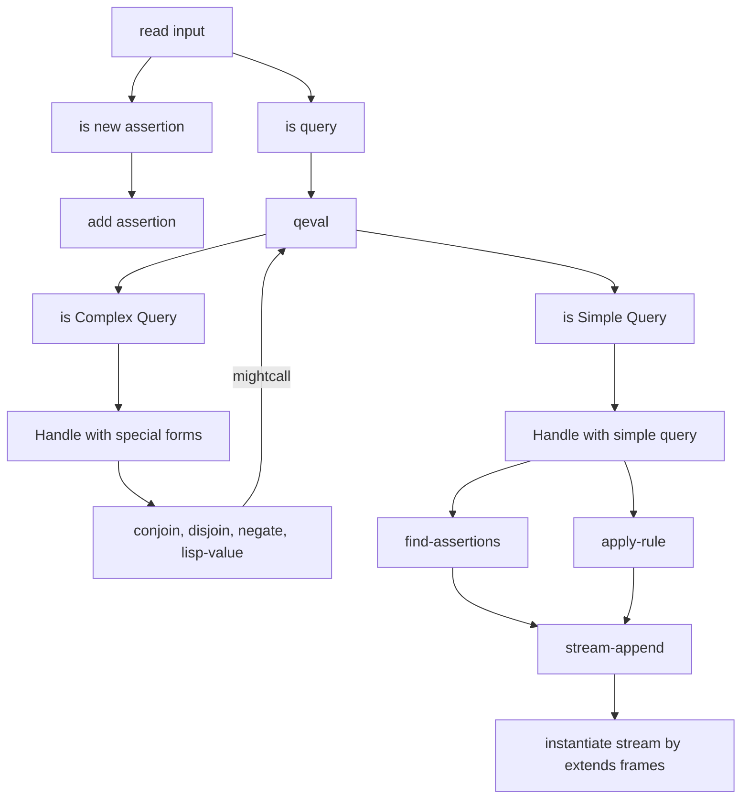

# Implementing the Query System

## The Driver loop and Installation

Driver Loop 和一般的 REPL 的 driver loop 类似，不停读取传入的的表达式。

如果传入的表达式为插入一个规则 (Rule) 或者断言 (Assertion). 那么就将它加入数据库。

否则，就将表达式理解为查询 (Query).  

1. Driver 会将查询传给我们的解释器 `qeval`， 同时也会初始化一个包括单个空 frame 的 stream 一并传入。
2. 解释器的输出同样是一个 stream，其中的 frame 是通过让用数据库中找到的变量值满足 (Satisfying) 查询 (Query) 生成的。
3. 这些 frames 会被用来形成一个新的 stream，这个 stream 会包括那个原始查询的副本，同时这些副本中的变量会被 frames 中的 bindings 进行实例化。
4. 最终我们将这个 stream 输出，也就是我们要的结果。

To instantiate an expression, we copy it, replacing any variables in the expression by their values in a given frame. The values are them- selves instantiated, since they could contain variables (for example, if ?x in exp is bound to ?y as the result of unification and ?y is in turn bound to 5). The action to take if a variable cannot be instantiated is given by a procedural argument to instantiate.

为了实例化一个表达式，我们复制它，用给定 frame 中对应变量的值进行替换。这些变量本身可能也需要被实例化。因为他们可能包含变量（例如如果 Unification 使得 `?x` 被绑定到 `?y,` 而 `?y` 又进一步被绑定到 5.)。在一个变量无法被实例化的情况下采取的动作由 instantiate 函数的另一个过程参数给出。

