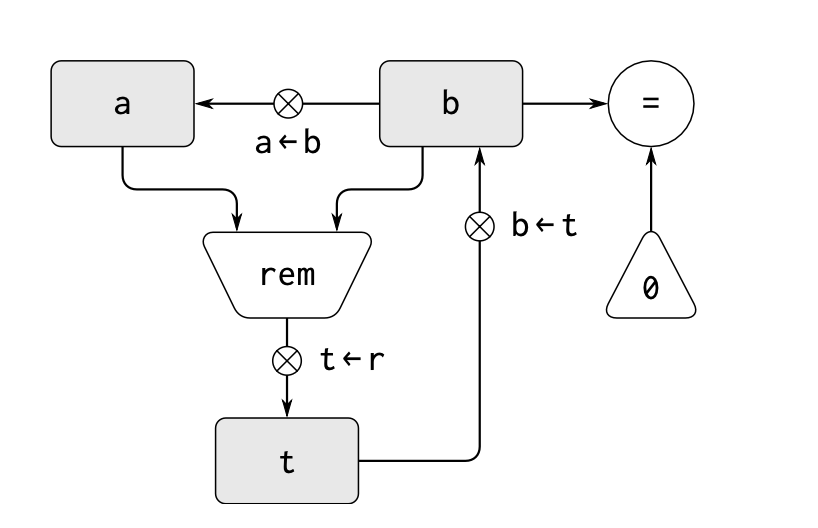

# 5.1 Designing Register Machines 设计寄存器机器

To design a register machine, we must design its _data paths_ (数据通路)(resgisters and operations) and the _controller_(控制器) that sequences these operations.

Let's examine Euclid's Alogrithm which is used to compute the greatest common divisor of two integers to see how to design a simple register machine

```scheme
(define (gcd a b)
    (if (= b 0)
        a
        (gcd b (remainder a b)))
```

为了实现一个支持此算法的机器， 我们需要跟踪 a 和 b 这两个数， 因此我们自然需要两个寄存器去存放他们。
我们同时假定自己有一个支持余数计算的机器 (remainder).
在这个运算的每一个循环中， 寄存器 a 的内容都会被 b 替代, b 的内容则会被余数取代, 此时我们会发现， 为了计算余数， 我们需要有第三个寄存器 t 来存储

下面则是我们给出的数据通路, 其中寄存器用举行表示， 赋值用箭头表示，数据随着箭头方向流动. 用圈叉表示一个 "按钮"
代表按压他的时候就会允许这个值进行流动。
而对于从常数或者寄存器内容触发计算一个值的操作用一个梯形框表示, 如下图中的 remainder(rem)



为了使得数据通路能够实现 GCD 计算， 按钮必须按照正确的顺序按动。
因此我们需要一个控制器图来描述这种顺序， 如下图:


## 1. A language for describing Register Machines

> 一种用于设计寄存器机器的语言

数据通路图 & 控制器图很适合描述像 GCD 这样的简单机器， 但如果用于描述大型机器。例如 Lisp 的解释器， 这些图就会变得非常麻烦了
为了能够处理复杂机器， 我们将创造一种语言， 以文本的形式直接给出数据通路图和控制器图给出的信息。

### 寄存器的描述

定义数据通路图的时候， 我们需要描述其中的寄存器和各种操作。

为了描述一个寄存器，

1. 我们需要给它一个名字
2. 我们需要指定一个分配给它的按钮. 而对于每个按钮
   1. 我们需要给出它的名字
   2. 我们需要指定按钮的控制下会进入这个寄存器的数据源 (可能是寄存器， 常量， 或者一个操作 operation)
      1. 为了描述一个操作 , 我们也需要给其一个名字， 并描述好他的输入

### 控制器的描述

我们将一部机器的控制器定义为一个指令 (instruction) 的序列， 另外再加上一些 label (标签), 表明 序列的入口 (entry points)
一个指令可以是下面几种东西之一

1. 数据通路图中的一个按钮， 按压它将使一个值被赋给一个寄存器
2. test 指令， 执行特定的检测
3. 有条件分支指令 (branch), 基于前面 test 的结果将操作转移到由某个控制器的 label 指定的位置。
   如果检测结果为 false, 则进行序列下方的下一条指令, 否则就执行指定 label 指定的那条指令
4. 无条件分支指令 (goto), 无条件的指明继续执行的控制器 label.

机器将从控制器指令序列的开始处启动，直到执行达到序列末尾时停止。这些指令总按照它们列出的顺序执行，除非遇到分支指令改变控制流。

下面给出了一个 GCD 的规范描述, 这种规范在实际场景中的可用性可能较差
```scheme
;; 定义了一些寄存器和操作
(data-paths
;; 定义寄存器
 (registers
   ;; 一个寄存器 = name + button
  ((name a)
   ;; 一个 button = name + source
   ;; 一个 source = 一个数据源 (register / 常量 / operation)
   (buttons ((name a<-b) (source (register b)))))
  ((name b)
   (buttons ((name b<-t) (source (register t)))))
  ((name t)
   (buttons ((name t<-r) (source (operation rem))))))
 ;; 定义操作
 ;; 一个 operation = name + 输入 list
 ;; 一个输入 = 一个或多个数据源 register / 常量
 (operations
  ((name rem) (inputs (register a) (register b)))
  ((name =) (inputs (register b) (constant 0)))))


;; 定义控制器流水线 (指令序列)
;; 一个控制器也有一个名字 (label)
(controller
   test-b                    ; label
   (test =)                  ; test 指令, 测试 = 操作的情况
   (branch (label gcd-done)) ; conditional branch 分支指令，若结果为真，则跳到 gcd-done, 否则下一步
   (t<-r)                    ; button push
   (a<-b)                    ; button push
   (b<-t)                    ; button push
   (goto   (label test-b))   ; unconditional branch  ;; 无条件跳转回开头
   gcd-done)                 ; label
```

因此我们有下面这种新的描述， 新的描述将要忽略掉对数据通路的描述。
```scheme
;; 仅保留 controller 描述, 混合数据通路指令
;; 其实感觉这玩意可读性更差了..
(controller
 test-b                                     ; label
   (test (op =) (reg b) (const 0))          ; test 指令, 并同时指定操作符和输入
   (branch (label gcd-done))                ; 分支指令, 若上面的 test 结果为真, 则跳到 gcd-done, 否则下一步
   (assign t (op rem) (reg a) (reg b))      ; 赋值指令, 将 register a 和 b 的值送给 operation rem 的输入，将产出的结果送给 register t
   (assign a (reg b))                       ; 将 register b 的值赋给 register a
   (assign b (reg t))                       ; 将 register t 的值赋给 register b
   (goto (label test-b))                    ; 无条件跳转回开头
 gcd-done)
```

#### Actions
接着，我们进一步的对这个 GCD 机器进行修改， 以便能
1. 把想要求 GCD 的数给它 (read)
2. 打印出结果 (print / display)
在这里我们忽略了具体如何处理硬件输入输出的细节，将其作为一种基础操作 (虽然机器语言控制操作系统打印和输入是最麻烦的事情)

读取操作 (read) 类似于我们一直在使用的其他操作,它会产生一个可以存储在寄存器中的值。但是,读取操作不会从任何寄存器中获取输入;它的值取决于发生在我们正在设计的机器部件之外的某些事情。我们将允许我们的机器操作具有这样的行为,因此我们将像绘制和标注任何其他计算值的操作一样绘制和标注读取操作的使用。
打印操作 (print) 则和我们已经使用的任何操作都具有 **本质性** 的不同: 它并不产生任何可以被存入寄存器的输出。虽然 print 能够产出一种效果， 但是这种效果却不是我们所设计的机器的一部分. 我们会将 print 这类操作称之为 *action* (动作).
action 通常会接受一个输入， 以及关联一个 Button 以触发这个动作。
为了使得动作可以被执行， 我们需要提供一种新的指令 `perform`，其表现如下:
```scheme
(perform (op print) (reg a))
```
加入 read 和 print 后，我们的 GCD 机器会变成这样:


其对应的 controller 代码长这样

```scheme
;; gcd with read & print
;; 这长得很像第四章我们见过的 driver-loop
(controller
 gcd-loop
   (assign a (op read))  ;; read 就像一个常规操作可以产出值， 但是值是来自于用户输入
   (assign b (op read))
 test-b
   (test (op =)
         (reg b)
         (const 0))
   (branch (label gcd-done))
   (assign t
           (op rem)
           (reg a)
           (reg b))
   (assign a (reg b))
   (assign b (reg t))
   (goto (label test-b))
 gcd-done
   (perform (op print)  ;; 为了打印， 我们需要使用 perform 去链接一个输入和一个 operation: print
            (reg a))
   (goto (label gcd-loop)))
```

## 2. Abstraction In Machine Design

> 机器设计的抽象
TODO

## 3. Subroutines

> 子程序:  过程抽象的底层

在设计进行计算的机器的时候, 我们会倾向于在计算不同的数据时, 如果遵循相同的规则, 则可以共享使用相同的部件, 而不是去多使用一个部件 (感觉起来也是一种抽象).

假设我们有一个包含两个 gcd 计算过程的机器. 其中一个从寄存器 a, b 中的数据中获取 gcd, 另一个则是从 c, d 中获取. 那么我们本身如果需要描述这两个 gcd 机器的话. 至少需要下面这样的 data path 和 controller:


很明显, 如果我们在设计机器时真的针对明明相同的运算去使用两个一摸一样的 gcd 机器是很亏的. 因为这里面的 rem 等运算机器可能是很复杂的

一种更好的思路是重用 gcd 里的寄存器和运算机器 在不需要 a, b 寄存器的值的时候, 我们将原本属于 c, d 寄存器的值转移给 a, b, (将 a,b 转移给其他寄存器). 再使用相同的 gcd 过程进行运算.

为了区别这两者, 我们只是使用不同的标签提示内部过程应该跳转回 gcd-1 的后面还是 gcd-2 过程的后面就好了

```scheme
gcd-1
 (test (op =) (reg b) (const 0))
 (branch (label after-gcd-1))
 (assign t (op rem) (reg a) (reg b))
 (assign a (reg b))
 (assign b (reg t))
 (goto (label gcd-1))
after-gcd-1
...
gcd-2
 (test (op =) (reg b) (const 0))
 (branch (label after-gcd-2))
 (assign t (op rem) (reg a) (reg b))
 (assign a (reg b))
 (assign b (reg t))
 (goto (label gcd-2))
after-gcd-2
```

到这里, 我们自然会想到是否能更进一步, gcd-1 和 gcd-2 两者的逻辑除了 goto 以外是完全一样的. 那能不能抽象这部分代码呢?

在这里, 我们就可以引入小节标题表明的概念: **Subroutine**

在 subroutine 的最后, 我们通过一个 test + branch 分支来判断是应该走回到主程序 (main) 的哪个具体位置.

而用来判断应该走哪个位置的寄存器的值, 我们就存放在一个叫做 continue 的寄存器里. 而在每个要执行的 gcd 要使用之前, 我们则将特定的标志值设置给 continue. 从而使得 gcd 结束之后, 我们能够回到对应的原始程序的后面那一行! 这似乎逐渐成为了我们提到的 “上下文切换” 或者 “堆栈” 的雏形.

```scheme
;; 使用 continue 去避免重复的控制器序列 
gcd
 (test (op =) (reg b) (const 0))
 (branch (label gcd-done))
 (assign t (op rem) (reg a) (reg b))
 (assign a (reg b))
 (assign b (reg t))
 (goto (label gcd))
gcd-done
 (test (op =) (reg continue) (const 0))
 (branch (label after-gcd-1))
 (goto (label after-gcd-2))
  ...
  ;; Before branching to gcd from the first place where it is needed
  ;; we place 0 in the continue register
 (assign continue (const 0))
 (goto (label gcd))
after-gcd-1
 ...
 ;; Before the second use of gcd, we place 1 in the continue register
 (assign continue (const 1))
 (goto (label gcd))
after-gcd-2
```

然而即使到这里, 我们的 controller 设计仍然有优化的空间, 因为如果我们不只是有 2 个 gcd 计算过程, 而是有更多个 gcd, 那么 岂不是 gcd-done 之后的 test 需要写非常多个子分支来判断具体应该跳转到哪里去? 而且这还必须在我们启动整个程序之前就完成跳转逻辑的设计, 这明显是很麻烦的.

一个更有效的设计自然是, 我们让 continue 寄存器去存储那个需要被跳转到的位置对应的 label. 这样我们只需要直接执行 goto 就完事了.

为了达成这个目标, 我们可能需要引入一种新的方式去建立寄存器机器中关于 data paths 和 controller 的联系: 

必须有一种方式，能用于在控制器序列 (Controller Seqeunce) 里将一 个 label 的值赋给一个奇存器，而所用的赋值方式又必须使这种值可以从奇存器里提取出来，用于决定继续执行的 entry point . 因此我们需要对 `assign` 和 `goto` 做一些改动. 改动后的涉及多个 gcd 的 controller 表示如下.

```scheme
gcd
 (test (op =) (reg b) (const 0))
 (branch (label gcd-done))
 (assign t (op rem) (reg a) (reg b))
 (assign a (reg b))
 (assign b (reg t))
 (goto (label gcd))
gcd-done
 ;; goto 应该能够将 reg 中读取到的值看作一个 label
 (goto (reg continue)) ...
 ;; Before calling gcd, we assign to continue 
 ;; the label to which gcd should return. 
 ;; label 也可以被作为一个特殊的常量值赋值给 continue 寄存器
 (assign continue (label after-gcd-1)) 
 (goto (label gcd))
after-gcd-1
 ...
 ;; Here is the second call to gcd,
 ;; with a different continuation.
 (assign continue (label after-gcd-2)) 
 (goto (label gcd))
after-gcd-2
```

如果我们的机器有不止一个 subroutine , 我们可以考虑使用多个 continuation 寄存器 (例如 gcd-continue, factorial-continue...), 也可以全局使用一个. 后者肯定更经济. 但是我们在处理子程序存在嵌套的情况时就需要十分小心了: 

假设我们有一个 子程序 (sub1) 调用了另一个子程序 (sub2). 除非 sub1 事先在其他的寄存器中存放了当时的 continue (用于标识 sub1 结束时应该回到外界的什么位置) 的值. 那么, 一旦 continue 被 sub2 退出时想要跳转的位置对应的 label 替代. 那么当 sub1 也结束时, 我们就不知道应该跳转到哪里了, 因为信息已经丢失了.

下一节中用于处理递归的机制也为嵌套子程序调用问题提供了更好的解决方案。

## 4. Using a Stack to Implement Recursion

> 利用堆栈实现递归

到目前为止, 我们已经描绘的思路已经可以帮助我们实现迭代的过程了. 简单来说, 它就是

1. 指定一个寄存器机器, 其中的每一个寄存器都代表着过程中的一个变量
2. 机器重复的执行 controller loop, 改变寄存器的内容, 知道到达某个种植条件.
3. 任何时刻, 机器的状态完全由寄存器的内容来决定.

然而, 当我们要实现递归过程的时候, 我们还需要增加一些额外的机制.

考虑这样一个求阶乘的过程:

```scheme
(define (factorial n)
  (if (= n 1) 1 (* (factorial (- n 1)) n)))
```

我们可以看出为了计算 $n!$ 我们需要先去计算 $(n-1)!$ 

与之对应, 我们考察一开始提到的 gcd 过程

```scheme
(define (gcd a b)
  (if (= b 0) a (gcd b (remainder a b))))
```

虽然它也是一个递归过程, 但是和求阶乘有略微的不同:

1. 求阶乘本质上是先要计算一个子问题, 才能回来计算这个问题
2. gcd 本质上是将当前的问题简化为一个新的计算. (其实这就是符合尾递归了), 这意味着产生的新的计算的解也就是原来最初的那个计算的解.

在处理 gcd 这类过程的计算时, 我们只需要不停的执行一个相同的 controller sequence, 只需要不停的将新的参数传给 input 寄存器中, 直到最终的问题被解决, 那么最初的问题也就等价于被解决了.

而对于求阶乘这类非尾递归的问题, 由于产生的新问题的解并不能等价于原始问题的解. 我们不能简单地通过替换 input 寄存器并重新执行原有的 controller sequence 来直接获得最终答案了, 而是需要另一个递归机器来解决子问题. 而这个子问题对应的第二个递归计算也有一个求阶乘的子问题... 而由于每一个求阶乘的机器都会有一个子机器去求解子问题, 这个机器将无法被实现, 因为它的组成部分是无限的.

不过, 虽然我们无法通过安排无限个阶乘机器来实现这类递归运算. 但我们仍然有别的办法可以绕过并最终完成目标(虽然是有条件的). 注意到, 虽然递归的过程看似是无限的, 但是在同时间内, 一定只有内部的一个问题在被求解. 因此, 我们实际上也应该只需要一个机器就能够实现目标. 只要我们能做到下面:

在主问题 (main problem) 遇到子问题并将要进入子问题 (subproblem) 之前, 我们可以将主进程 的工作 “挂起” (suspend).  利用相同的物理部分去解决子问题. 在解决完子问题后, 在恢复被挂起的工作.

在每一个子问题中, 当前寄存器的值都是不同的, 在 factorial 机器中, 这个寄存器 (n 的值对应的) 的值会逐渐减小. 为了能够继续/恢复被挂起的计算, 我们需要将这些子问题中的寄存器的值全部存 (save) 起来. 而在恢复时, 能将这些存起来的值进行还原 (restore).

同时, 我们存储的值为了进行还原, 需要和原来执行的一系列主问题/子问题形成一一对应, 这里用指针肯定太贵了且没有意义, 因此我们可以考虑直接使用 stack (栈) 这个数据结构来做这个事情. 使用栈, 我们在执行最外层过程时就将当时的寄存器值压入栈底, 随着子问题的深入, 我们的栈不断增长. 最终直到子问题被解决. 我们就可以利用栈顶的寄存器去完成上一级问题的解决, 再逐步弹出栈从而最终完成最外层问题的解决了.堆栈中寄存器值存储的顺序和主程序->子程序的衍生顺序正好是反的.

基于堆栈, 结合我们在第三部分中提到的 子程序 + continue 寄存器机制, 我们就可以实现对 factorial 这类非尾递归的实现. 其数据通路图和 controller 描述如下

1. 预先设置 continue 为 fact-done, 这样如果执行已经完全结束, 可以使得程序终止

2. 每次进入 loop 循环时
   1. 检查是否到达基准条件 (n = 1), 若到达, 则直接进入 base-case 的值, 此时 base-case 有两种情况
      1. 如果用户最外层传入的就是 n = 1, 则 goto continue 会直接使得整体结束
      2. 如果最外层 n > 1, 此时的 continue 肯定是 上一层 save 压进栈的, 此时会会推到上一层
   2. 如果没有到达基准条件, 则
      1. 开始压栈存放此时 fast loop 完成后的退出位置和现场的 n 值. 
      2. 将 continue 和 n 赋值为 after-fact 和 n - 1
      3. 进入下一轮递归, 重新进入判断.

这里 val 保存着子问题的结果, 在递归到达基准条件时 (n = 1), 从 n 获取结果, 否则就是获取子问题的结果 * n 计算为新的 val 的值. 在返回外层的程序执行时, 该物理设备被再次使用, 而 val 的值就可以被用到了. 


```scheme
(controller
  (assign continue (label fact-done)) ;set up final return address
fact-loop
  (test (op =) (reg n) (const 1))
  (branch (label base-case))
  ;; Set up for the recursive call by saving n and continue.
  ;; Set up continue so that the computation will continue
  ;; at after-fact when the subroutine returns.
  (save continue)
  (save n)
  (assign n (op -) (reg n) (const 1))
  (assign continue (label after-fact))
  (goto (label fact-loop))
after-fact
  (restore n)
  (restore continue)
  (assign val (op *) (reg n) (reg val))  ;val now contains n(n - 1)!
  (goto (reg continue))                  ;return to caller
base-case                                
  (assign val (const 1))                 ;base case: 1! = 1
  (goto (reg continue))                  ;return to caller
fact-done)
```

虽然看起来这里的实现需要我们提供一台具有无穷堆栈的机器. 但是在现实生活中堆栈肯定是有限的. 通常堆栈都会有最大的栈深度. 这也是为什么某些无限递归会导致爆栈了~ 同时, 有的递归计算过程中, 即使产出了某些变化的值, 但是这些值也不一定要保存在栈中, 这个是视情况而定的.

### A double recursion 

> 一个双重递归的实例

lisp 代码

```scheme
(define (fib n)
  (if (< n 2) n (+ (fib (- n 1)) (fib (- n 2)))))j
```

控制器

```scheme
(controller
  (assign continue (label fib-done))
 fib-loop
  (test (op <) (reg n) (const 2))
  (branch (label immediate-anwser))
  ;; setup to compute Fib(n-1)
  (save continue)
  (assign continue (label afterfib-n-1))
  (save n)                                    ; save old value of n
  (assign n (op -) (reg n) (const 1))         ; clobber n to n-1
  (goto (label fib-loop))                     ; perform recursive call
 afterfib-n-1                                 ; upon return, val contains Fib(n-1)
  (restore n)                                 
  ;; (restore continue)
  ;; no need, setup to compute Fib(n-2)
  (assign n (op -) (reg n) (const 2))
  ;; no need, (save continue)
  (assign continue (label afterfib-n-2))
  (save val)                                  ; save Fib(n-1)
  (goto (label fib-loop))                        
 afterfib-n-2                                 ; upon return, val contains Fib(n-2)
  (assign n (reg val))                        ; n now contains Fib(n-2)
  (restore val)                               ; val now contains Fib(n-1)
  (restore continue)
  (assign val (op +) (reg val) (reg n))       ; Fib(n-1) + Fib(n-2), fib(n-2) 其实也是 fib(n-1) 的子问题
  (goto (reg continue))
 immediate-anwser
  (assign val (reg n))                        ; base case: Fib(n) = n
  (goto (reg continue))
 fib-done)

```


伪代码简单解释

```
subroutine:
                                                                                                                     
fib-loop n
  if base case 
     then goto immediate-anwser
  else
     we will try to compite fib(n-1), so:
                                                                                                                     
     set n = n - 1
     set continue = afterfib-n-1
     goto fib-loop to compute fib(n-1)
                                                                                                            
immediate-anwser n
  set val = n
  goto continue
    if fib-done, then just finish
    if afterfib-n-1 / afterfib-n-2, then execute it
                                                                                                               
afterfib-n-1
  we will try to compute fib(n-2)
  to compute fib(n-2), we need get the original n (now has been set to n-1), so:
 
  restore n from stack
  set n = n - 2
  set continue = afterfib-n-2
  save val(computed by fib(n-1)) to stack, laterly it will be used as part of adding (+ (fib (- n 1)) (fib (- n 2)))
  goto fib-loop to compute fib(n-2) 
                                                                                                            
afterfib-n-2
  we will try to get result of fib(n-1) + fib(n-2)
                                                                                                                     
  set n = val
  restore val from stack to get pre-calculated fib(n-1)
  restore continue stack to get the original continue
  set val = val + n
  goto continue to return to outter level stack
                                                                                                                
;; 实际上本身我们的寄存器机器也是类似 DFS 策略先运行到最底层, 再逐渐向上返回的
                             
  fib 3
1  |
  fib 2 + fib 1
   |     6 |  | 7 
2  |-------+  +--------> omit others
   |
  fib 1 + fib 0
3  |     4 | | 5
   1-------  0

```

