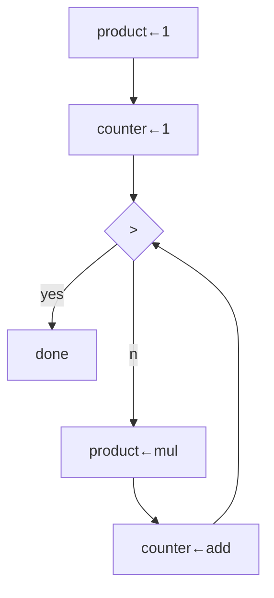

## quiz 5.1

```scheme
;; 画出下面的过程的 data-path 和 controller 图
(define (factorial n)
  (define (iter product counter)
    (if (> counter n)
        product
        (iter (* counter product) (+ counter 1))))
  (iter 1 1))
```




